# [buy-and-sell-market](http://buy-and-sell-market.herokuapp.com/)

- [DEPLOYED APP CAN BE FOUND HERE](http://buy-and-sell-market.herokuapp.com/)
- [CODE CAN BE FOUND HERE](https://github.com/frankkode/buy_and_sell_market)

INTRODUCTION:
In this project I have created a FREE MARKET website to demonstrate my understanding of the flask-python microframework and mongodb databases. From a user perspective the website should allow them to view, add and edit posts and  also to view other peoples posts on the main page 
## UX
This project is the assessment of the flask-python modules for the Full Stack Software Development  at Code Institute. I chose to create a web application that allows users to benefite from it. Each user should be able to Create, Read, Update, and Delete (CRUD) their own posts. Users can also be able to contact each other througt the self given contacts.

User Stories
"As a user, I want:"

to view the site on my preferred device (mobile, tablet, desktop).
to create my own account
to update my posts
to create posts
to edit my own posts
to delete my own posts
to sell my items free of charge
to view posts of others

## Technologies Used

### Languages

- **[HTML5](https://developer.mozilla.org/en-US/docs/Web/Guide/HTML/HTML5)** was used to set up the templates for the site.
- **[CSS3](https://developer.mozilla.org/en-US/docs/Web/CSS/CSS3)** was used to style the site content.
- **[JavaScript](https://www.javascript.com/)** 
I have used Javascript in the add/edit post forms to power the logic behind the 'Edit post' and 'view information' buttons. I have also used this to create a validation error for the Materialize select component 
JS has also been used to power the sliding side menu action on smaller screen sizes
was used to initialise some of the Materialize elements and ensure that they worked correctly.
- **[Python](https://www.python.org/)** was used to write the app's logic.
- **[MongoDB](https://www.mongodb.com/)** was used as the database .


### Frameworks/Libraries

- **[Flask](http://flask.pocoo.org/)** was used to create routes and render the HTML templates.
- **[Materialize](https://materializecss.com//)** was used as the basis for the site's design and responsiveness.


### Tools

- **[Git](https://git-scm.com/)** was used for version control.
- **[Heroku](https://www.heroku.com/)** was used to deploy the project.
- **[MongodbAtlas](https://docs.atlas.mongodb.com)** was used to set up the database.
- **[Balsamic](https://balsamiq.cloud/spsngzf/pe97rf5/r2278)** was used to create the wireframes.
- **[unittest](https://docs.python.org/2/library/unittest.html)** was used for automated testing of the Python code.

### Features Left to Implement
- ***Additional search capabilities*** : In future I would like to impliment the ability to search by entering a certain word in the search input.

- ***Photo upload*** : In fiture i would like to give the user the ability to upload a photo file locally as opposed to a photo-url.

## Testing

### Code Validity

- I used the [W3C Markup Validation Service](https://validator.w3.org/) to check the HTML 
- I used [W3C CSS Validation Service](https://jigsaw.w3.org/css-validator/) to check the CSS. 
  The W3C Markup Validation Service gives error messages for Flask Jinja code in the HTML files.
- i used pip8 online formatter (http://pep8online.com/) to check python indentation


### Automated Tests

I conducted automated testing of the app routes with unittests, and the tests are in test_app.py at the root directory. Run the tests by entering ```python3 test_app.py``` in the terminal.
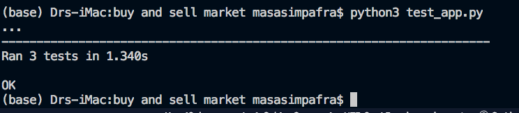 

  
### Manual Tests

I conducted manual tests of the application as follows:

1. Cross-browser and Device Compatibility
    - Test the app on Chrome, Edge, Firefox Opera and Safari browsers to ensure that it works on all of them.
    - Test the app on a desktop, laptop, tablet and smartphone to ensure that it works on all devices.

2. Responsiveness
    - View the app in responsive mode with Chrome Developer Tools to ensure that the size and position of elements adjusts correctly.
    - View the app on a desktop, laptop, tablet and smartphone to ensure that it displays correctly.

3. Registration
    - Navigate to the registration page.
    - Enter a username and password.
    - get registrad
    - redirected to home page (with option to start post your items on navbar)
     
4. Login
    - Navigate to the login page.
    - Enter a correct username and password.
    - get loged in
    - Ensure that I can add a post and edit and delete post submitted under that username, and that I can't edit or delete other user's posts.
    - Ensure that, when I click on the "My items" link in the navbar, I see the list of my posts and no others.
    - Click on the Logout link in the navbar and ensure that I'm logged out.
    - Enter a username that's not in the database .
    - Ensure that i get a registration form.
    - Enter a username that it is in the database and correct password.
    - Ensure that i get loged in on the free market.

5. Adding posts 
    - Click on the "Add new item" link on the navbar.
    - Ensure that the form appears correctly.
    - Attempt to submit the form with required fields blank and ensure that I'm prompted to fill them.
    - Submit a fully completed form.
    - Click on the button "Add" to the form of the post insure that all information was submited correctry.
    - Ensure that the page showing that post loads correctly, with all entered details appearing on the calling (home) page.
    - Ensure that all the posts details have been saved in the database.


 
7.  Editing post
    - go to "my items" button on the navbar link
    - Click on the Edit button at the bottom of a post 
    - Ensure that the form for editing the post loads.
    - Edit the post details.
    - Click the Submit button.
    - Ensure that the post reloads and the edits have been saved to the database.
    

9. Deleting posts
    - Click the Delete button at the bottom of the post .
    - Ensure that a cancel button appears, along with  delete button 
    - Click Cancel.
    - Ensure that the page reloads correctly.
    - Click the Delete button .
    - Ensure that the post is deleted from the database.
    

## WIREFLAME BY BALSAMIQ
### Main Page
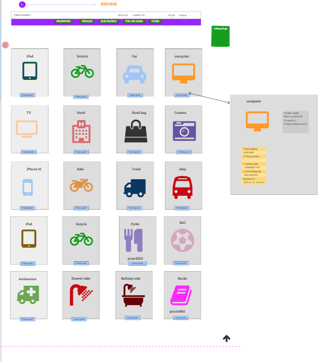
### Edit Item
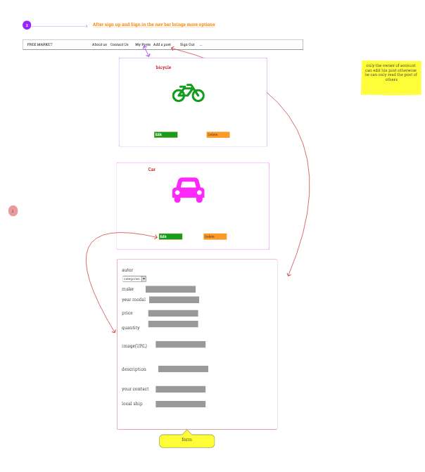
### Contact Us
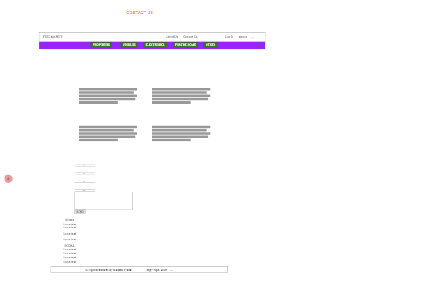
### About us
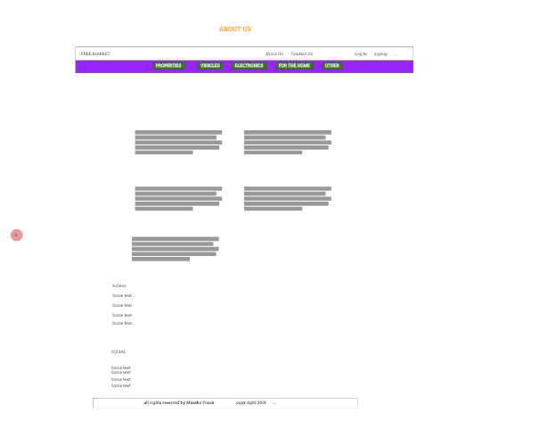
### Database schema
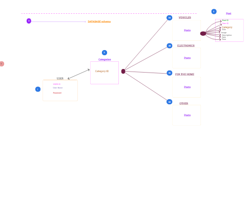

## Deployment

I deployed the project on Heroku as follows:
1. Create a new app on Heroku and name it buy-and-sell-market.
2. Create a Heroku remote.
Deploy to Heroku using git:
$ git add .
$ git commit -m "commit message"
$ git push heroku master
3. Ensure that the project included a Procfile and requirements.txt.
4. Push the project to the Heroku remote.
5. Start a web process by entering the following in the terminal: ``heroku ps:scale web=1``
6. Set the IP to 0.0.0.0 and the PORT to 5000 in the Heroku config vars.
7. Set the MONGO_URI,DATABASENAME,EMAIL,PASSWORD environment variable in the Heroku config vars.
8. Restart all dynos.
9. Open the app on Heroku and check to ensure that it's working correctly.


### Running the Code Locally

Steps 1-6 were copied from [here](https://github.com/frankkode/buy_and_sell_market)
1. Under the repository name on GitHub, click Clone or download.
2. In the Clone with HTTPs section, click the icon beside the URL to copy the clone URL for the repository.
3. Change the current working directory to the location where you want the cloned directory to be made.
4. Type git clone, and then paste the URL you copied in Step 2.
5. Press Enter. Your local clone will be created.
6. Set up a virtual environment.
7. Install the packages in requirements.txt by typing pip install -r requirements.txt in the CLI.
8. Set the IP address to 127.0.0.1 and the PORT to 5000.

## App Image
### main page
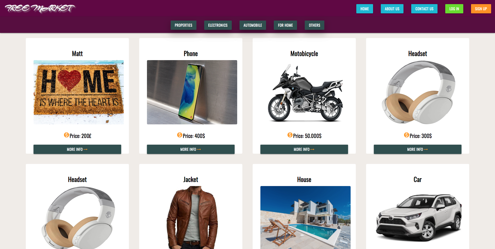
### Edit Post 
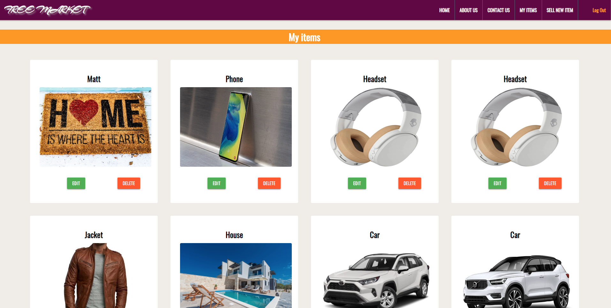
### Sign up Form
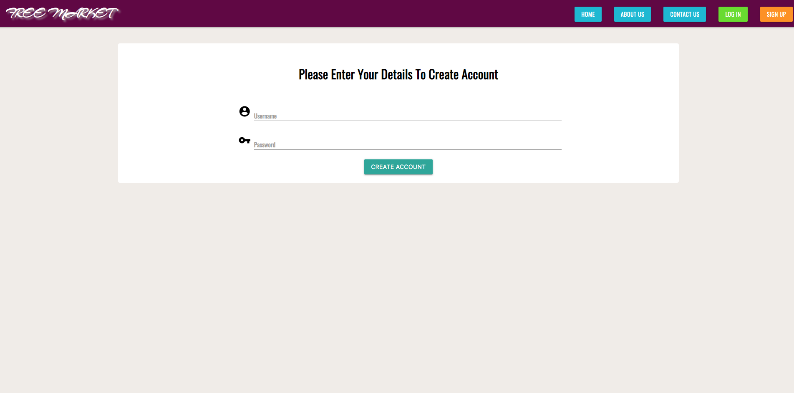
### Login Form
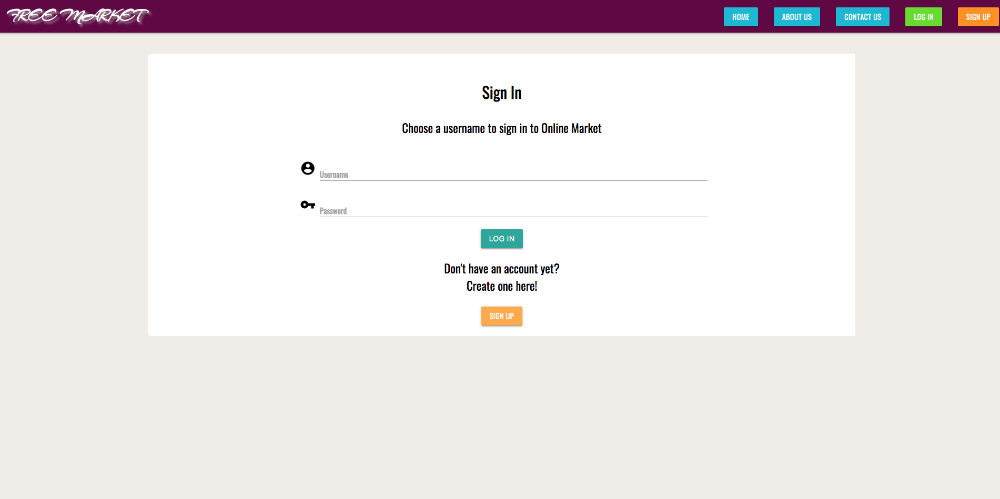
### About us
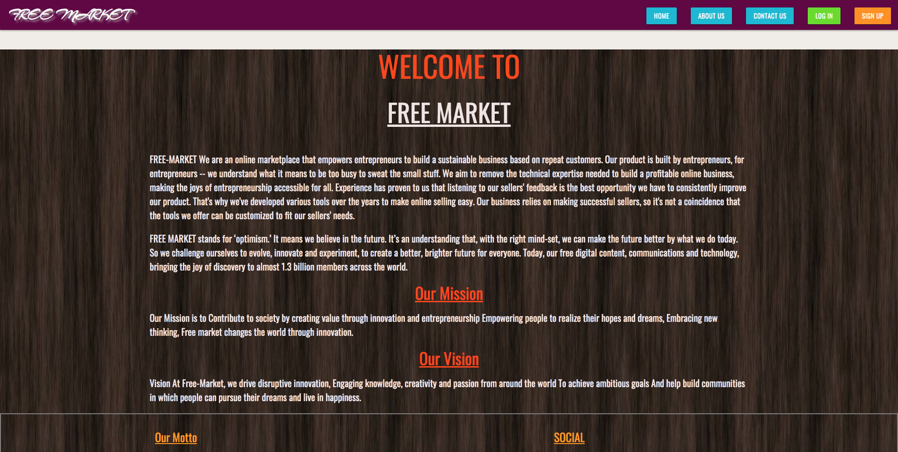
### Contact us
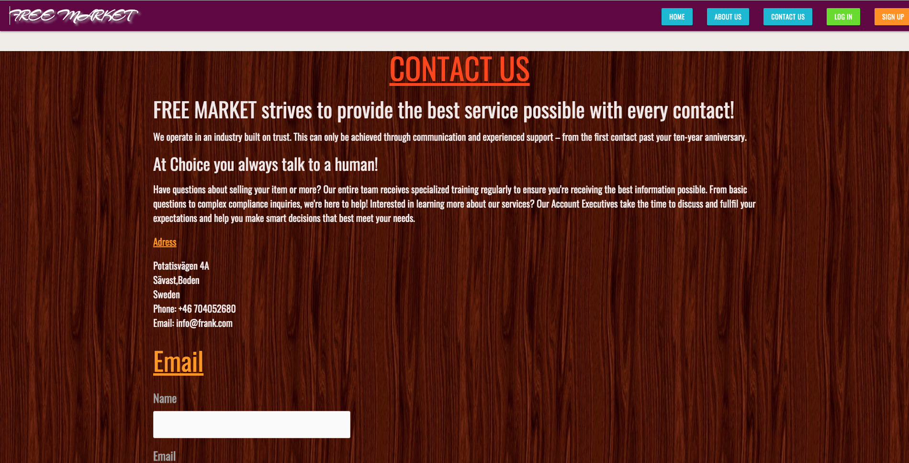
### Contact us
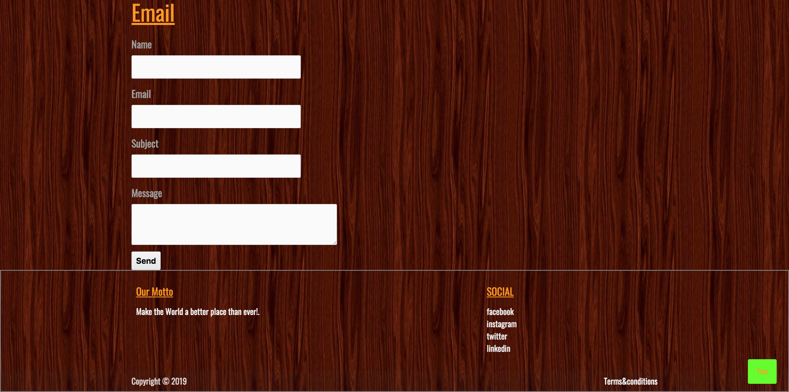
### Edit item
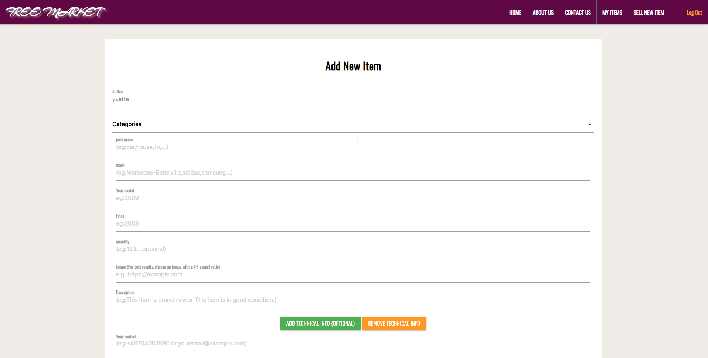

## Credits

### Media&code
## The website images were taken from the following sources:

- contact and about us background  images  was taken from:[UNSPLASH](https://unsplash.com/)
- pics on items was taken from : [Google](https://www.google.com)

- contact form was taken from : [flask-mail](https://pythonhosted.org/Flask-Mail/)


### Acknowledgements
- Many thanks to my mentor [Anthony Ngene](https://app.slack.com/client/T0L30B202/C0L316Z96/user_profile/UDNCUURHU) for his helpful feedback and support during this project
- Many thanks to CODE INSTITUTE tutorial team mainly Niel,Haley and Samantha 
